### Hi there! My name is Sebastian 👋

I'm passionate about software maintainability (quality assurance, testing, tooling, and documentation) and an advocate for open source and open science. I love to play around with data and see what it can tell you when looking at it from different angles.

## ⚡ Quick facts about me

- 🎓 Bachelor of Science in physics and currently finishing my master
- 🏢 I'm currently working at [Cassini Technologies](https://cassini-technologies.com/)
- 🌱 I’m currently learning more about more advanced typing concepts in python
- 🤔 I’m looking for help with [a python teaching project for students](https://github.com/students-teach-students/python-tools-for-students)
- 💬 Ask me about Python, Tooling to improve your workflow and automating stuff
- 😄 Pronouns: [He/Him](https://www.mypronouns.org/he-him)
- 🤘 Metalhead: Can't work properly in silence, I need my music!
- 🎱 I prefer dark themes if you do so as well check out [this theme for github](https://github.com/StylishThemes/GitHub-Dark)
- 📖 Favorite Quote:
  > `*Smash fist on the table*` There must be an better way! - Raymond Hettinger

💻 Some of the technology's I use

 :octocat: My Github stats

 
Oh yeah, I'm a huge fan of nerdy jokes and word plays 😜

